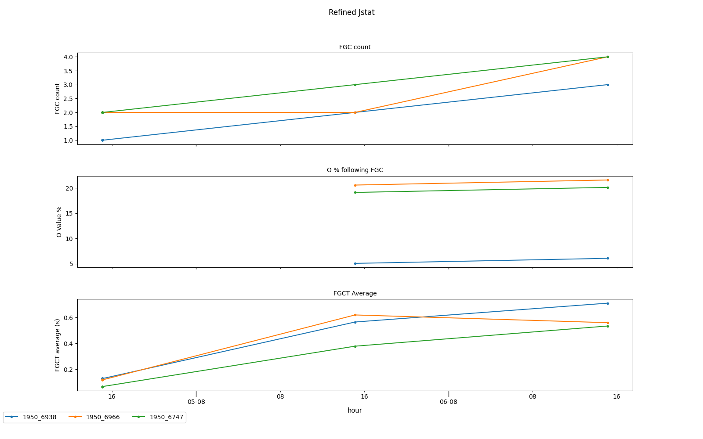

# Filtered Jstat
Filtered Jstat graphs old storage percentage, full garbage collection occurances, and full garbage collection time for all applicable processes in all instances in the desired EMR Cluster. 

## Description
From the Master node, *Main.py* runs jstat_starter, sleeps for one hour and extracts the jstat output from each instance in an endless loop. In order to graph O%, FGCT, and FGC, *grapher.py* should be run. The graph will be uploaded to s3 to specified bucket. 

If desired, all jstat processes inclduing *main.py* can be killed by running *jstat_killer.py*. 
___
### Getting Started
In order to use Filtered Jstat, there must be at least one running EMR Cluster with both master and worker node(s). the security group of the master node must have ssh/port 22 available. The ssh key must be saved in AWS Secrets Manager. 
___
### Executing Program
1. (required): open ssh on the security group of the master node from the local machine.
2. run aws configure on the local machine, ensure that the region name is the same as the EMR Cluster Region:  
    `aws configure`
3. change `SecretName` in *config.ini* to the key used stored in AWS Secrets Manager
4. change `RegionName` in *config.ini* to the region the key is stored in. 
5. grant the Master Node access to AWS Secrets Manager by using IAM. This can be done by adding the below policy (while pasting the ARN) to the MasterNode Role.  
```json  
        {
            "Version": "2012-10-17",
            "Statement": [
                {
                    "Sid": "VisualEditor0",
                    "Effect": "Allow",
                    "Action": "secretsmanager:GetSecretValue",
                    "Resource": "<secret_arn>"
                }
            ]
        }

3. ssh into the master node of the cluster:  
    `ssh -i <path_to_key> ec2-user@<MasterNode_PublicIP>`   
4. install git:  
    `sudo yum install git`
6. clone emr_project to Master Node:   
    `git clone https://github.com/yan-bev/emr_jstat_project`
7. install python modules:  
    `pip install paramiko pandas matplotlib boto3`
8. (optional): create a s3 bucket to hold the graphs (required): replace `S3BucketName` in *config.ini* with the desired s3 bucket. 
9. run main.py:  
   `python3 main.py &`
10. run *grapher.py*:  
    `python3 grapher.py`
11. (optional): run *jps_killer.py* to stop all jps processes and jps output files on the worker node(s) as well as remove csv files from the master. this will also kill the *main.py* process.  

___
### Graph Output With Test Data

